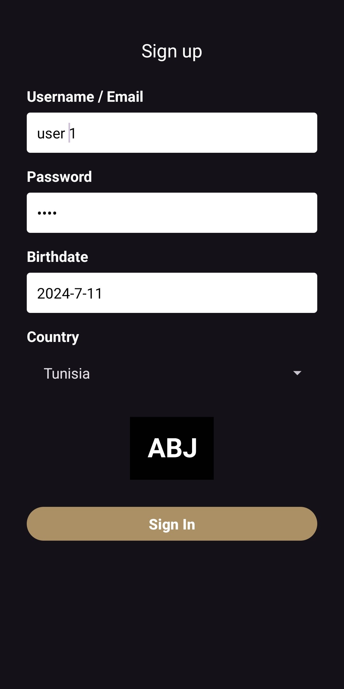
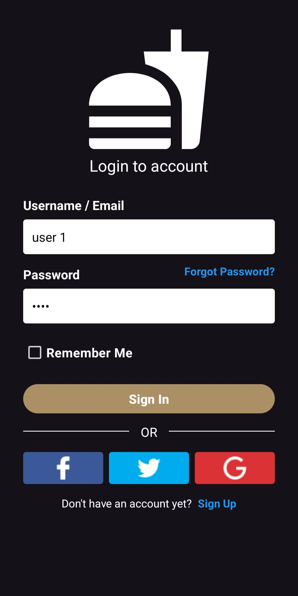
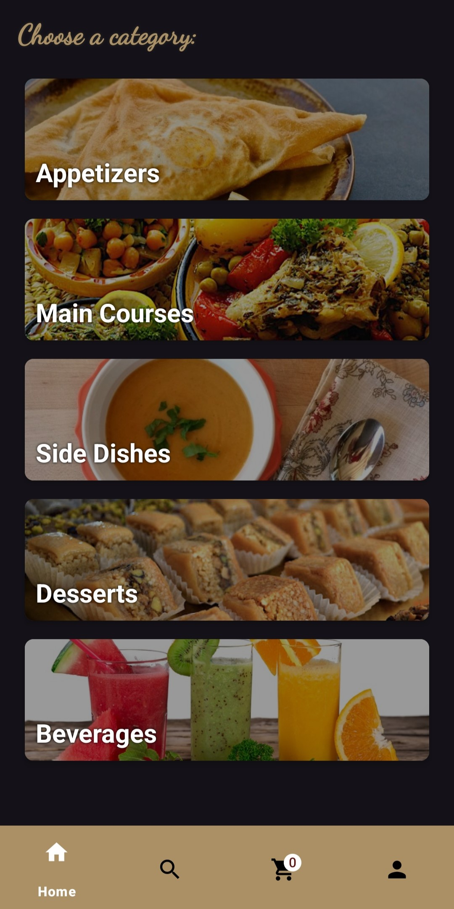
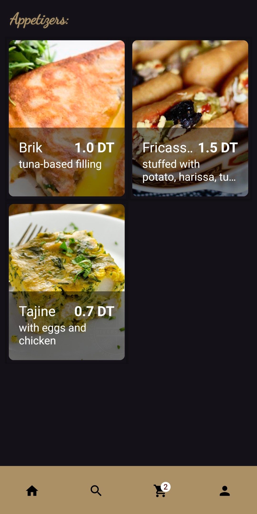
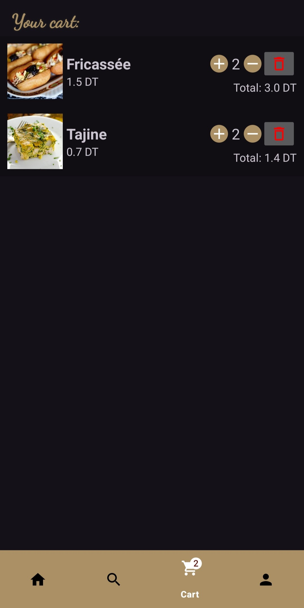
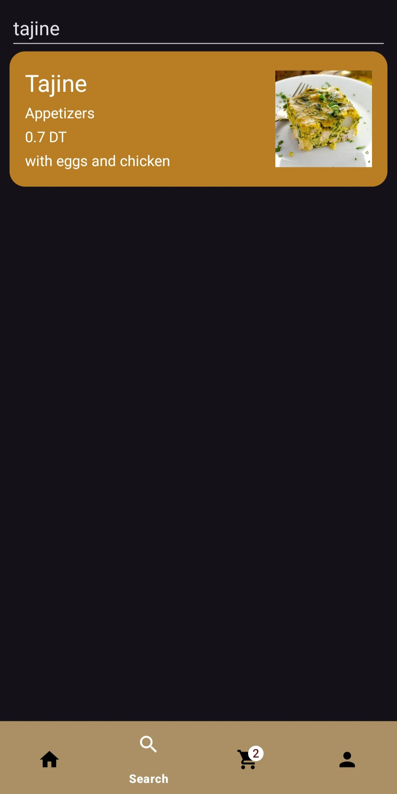
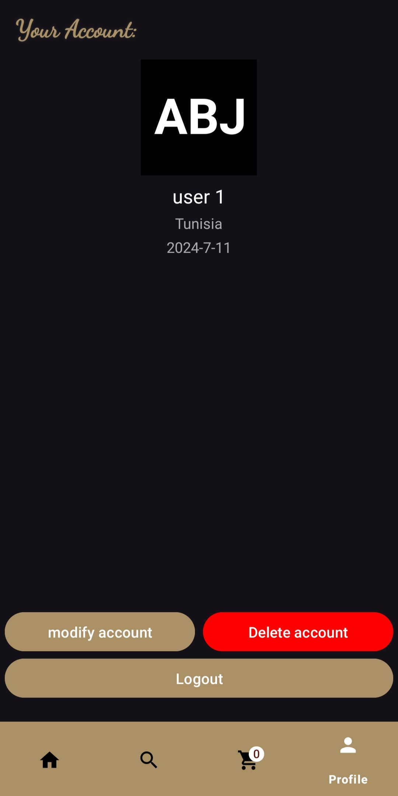
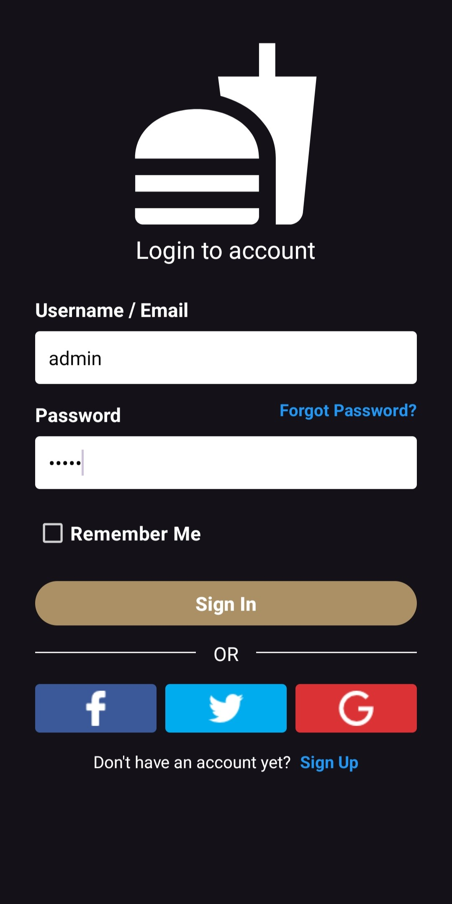
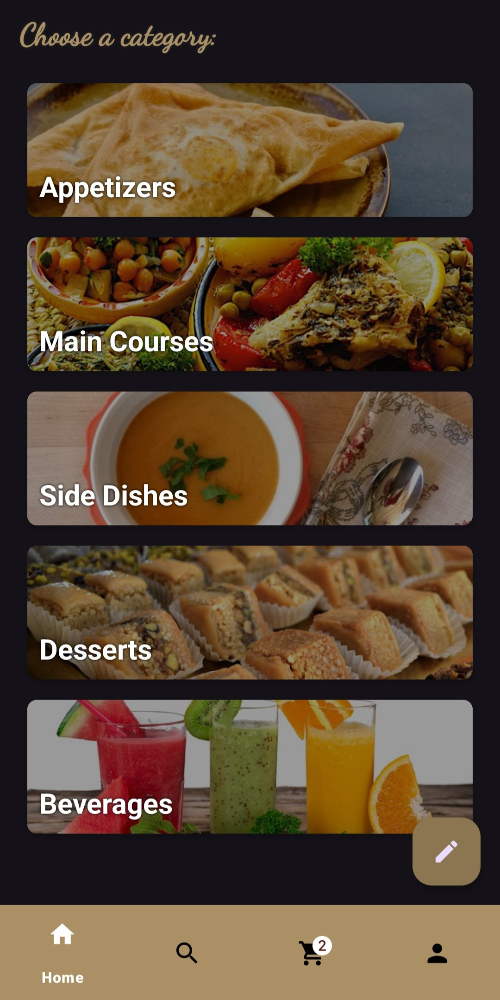
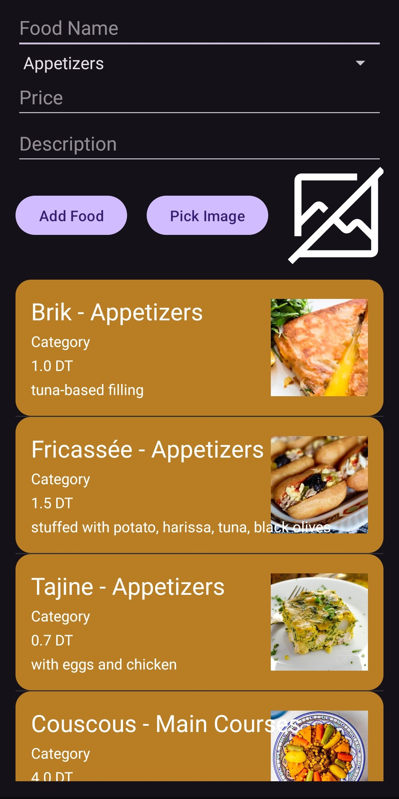

# Restaurant Management App

A robust Android application designed to streamline restaurant operations, offering seamless admin and user functionalities. Built with Java and SQLite, this app provides an intuitive interface for managing menus, user accounts, and orders, with full offline support for optimal performance.


## Features

### Admin Panel
- Access the admin dashboard using "admin" credentials.
- **Menu Management**: Add, edit, or delete food items with details including:
  - Name
  - Description
  - Price
  - Image
- **Real-Time Updates**: Menu changes are instantly reflected in the app.

### User Experience
- **Account Management**: Register and sign in with personal credentials.
- **Menu Browsing**: Explore a categorized grid view of food items with detailed descriptions and images.
- **Cart Functionality**: Add items to the cart with adjustable quantities for easy ordering.
- **Search Functionality**: Search for food items.
- **Profile Management**: Update and manage user profile details.

### Local Database
- **SQLite Integration**: Stores all restaurant data (menu items and user accounts) locally for fast access.
- **Data Persistence**: Ensures reliable storage and retrieval, even offline.

## Screenshots

### Signup Page
<div style="text-align: center;">
  
</div>
*Create a new user account with personal credentials.*

### Sign-In Page
<div style="text-align: center;">
  
</div>
*Log in using registered user credentials.*

### Home Page
<div style="text-align: center;">
  
</div>
*View the main interface with access to menu, cart, search, and profile.*

### Category Grid View
<div style="text-align: center;">
  
</div>
*Browse food items in a grid layout; tap an item to add it to the cart.*

### Cart Tab
<div style="text-align: center;">
  
</div>
*View and adjust quantities of items added to the cart.*

### Search Tab
<div style="text-align: center;">
  
</div>
*Search for food items with an example search query.*

### Profile Tab
<div style="text-align: center;">
  
</div>
*Manage user profile details with a dedicated button.*

### Admin Login Page
<div style="text-align: center;">
  
</div>
*Access the admin interface with admin credentials.*

### Admin Home Page
<div style="text-align: center;">
  
</div>
*View the admin dashboard for managing restaurant operations.*

### Admin Elements Management
<div style="text-align: center;">
  
</div>
*Add new food items via a form and view/delete existing items from the database.*

## Getting Started

Follow these steps to set up and run the app locally:

1. **Clone the Repository**:
   ```bash
   git clone https://github.com/AymenBenJdidia/Restaurant-Management-App.git
2. **Open in Android Studio**:

Import the project into Android Studio.
Ensure the latest Android SDK is installed.

3. **Build and run the app on an emulator or device**

Connect an Android emulator or physical device.
Build and run the app via Android Studio.

## Technologies Used

- **Java**: Core language for Android development.
- **SQLite**: Lightweight database for local data storage.
- **Android Studio**: IDE for development, testing, and debugging.
- **XML**: Used for designing intuitive UI layouts.

